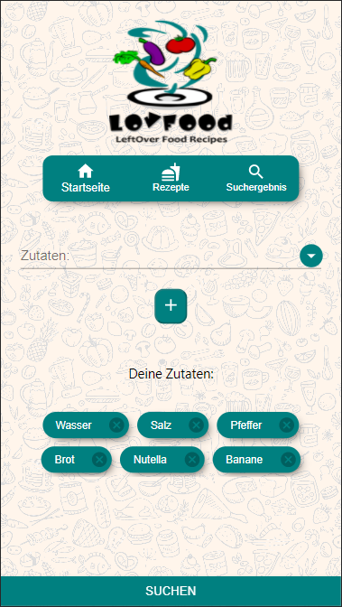

# LovFood

> Digitales Gesellenstück für das neuefische Java Developer bootcamp

## `Beschreibung`

### Suche mit den restlichen Zutaten, tolle Rezepte.

Mit dieser innovativen App kannst du mit den übrig gebliebenen Zutaten nach tollen Rezepten suchen. Sollte der Kühlschrank doch noch voll sein, warten auch so tolle Rezepte auf dich.

### `Demo`

### `Browserversion`
[Zur Webseite](https://lovfood.herokuapp.com/)

## `Tech Stack`

- React
- React Hooks
- React Router
- Styled Components
- Maven
- MongoDB
- Mockito
- Git
- Docker
- Heroku
- CI/CD
- JavaScript
- Java
- HTML5
- CSS3
- Material UI
- JUnit
- Lombok
